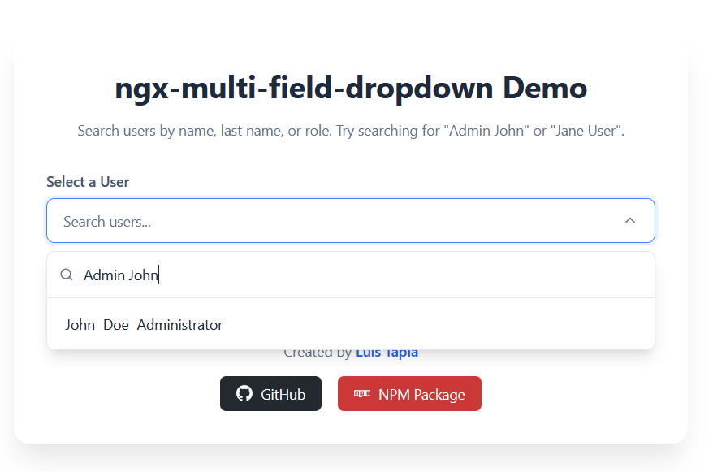

# ngx-multi-field-dropdown 🌟

[](https://www.npmjs.com/package/ngx-multi-field-dropdown)
[](https://opensource.org/licenses/MIT)
[](https://stackblitz.com/github/luismtapiab/ngx-multi-field-dropdown/tree/master/example)


A customizable, lightweight, and high-performance Angular searchable dropdown component with multi-field search support. Driven by **Angular Signals** for optimal performance and reactivity.

Demo:

- Live demo on Render: https://ngx-multi-field-dropdown.onrender.com/ (preview built with Docker, made during this excelent course:  http://devopswithdocker.com)

- Github Pages: https://luismtapiab.github.io/ngx-multi-field-dropdown

- or in StackBlitz:
👉 **[Open in StackBlitz Live Editor](https://stackblitz.com/github/luismtapiab/ngx-multi-field-dropdown/tree/master/example)**

---

## ⚡ Features
- 🔍 **Multi-Field Search**: Query items by multiple keys/properties simultaneously.
- 🚦 **Reactive Core**: Built using Angular Signals for modern, high-performance reactivity.
- 🎨 **Fully Customizable Styles**: Styled with custom CSS variables that are easy to override.
- ⌨️ **Keyboard Navigation**: Designed with accessibility in mind.
- 📦 **No Workspaces Required**: Completely standalone structures for simple local development and robust packaging.


## 📂 Repository Structure
This repository contains both the library source code and a clean, fully-functioning example application:

- **[`ngx-multi-field-dropdown/`](./ngx-multi-field-dropdown)**: The library source folder.
- **[`example/`](./example)**: A standalone Angular application demonstrating how to import and use the library.

---

## 📦 Installation

To install the library, run the following command in your Angular application directory:

```bash
npm install ngx-multi-field-dropdown
```

---

## 🛠️ Quick Usage

1. **Import the component** in your Angular component:

```typescript
import { Component } from '@angular/core';
import { MultiFieldDropdownComponent } from 'ngx-multi-field-dropdown';

@Component({
  selector: 'app-root',
  standalone: true,
  imports: [MultiFieldDropdownComponent],
  templateUrl: './app.component.html'
})
export class AppComponent {
  // Your data list
  items = [
    { id: 1, name: 'John Doe', role: 'Developer', dept: 'Engineering' },
    { id: 2, name: 'Jane Smith', role: 'Designer', dept: 'Creative' }
  ];

  // Configure search fields
  searchFields = ['name', 'role', 'dept'];
}
```

2. **Add it to your HTML**:

```html
<ngx-multi-field-dropdown
  [items]="items"
  [searchFields]="searchFields"
  displayField="name"
  placeholder="Search by name, role or department..."
  (selectionChange)="onSelectionChange($event)">
</ngx-multi-field-dropdown>
```

---

## 📄 License
This project is licensed under the MIT License - see the [LICENSE](LICENSE) file for details.
